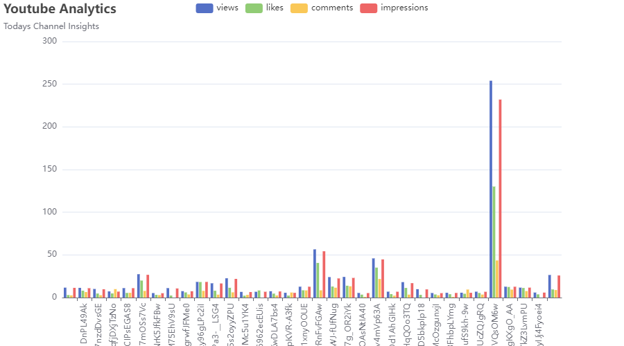

# Youtube Analytics

A brief description of what this project does and who it's for

## Tech Stack

**backend:** Golang, Postgres, RabbitMQ

## Prerequisites


Setup Postgres server

https://www.redhat.com/sysadmin/postgresql-setup-use-cases

Setup RabbitMQ server

https://www.cherryservers.com/blog/how-to-install-and-start-using-rabbitmq-on-ubuntu-22-04

Create API key in GCP

https://developers.google.com/youtube/v3/getting-started

## Setup

Clone the project

```bash
git clone https://github.com/Bittu96/youtubeAnalytics.git
```

Go to the project directory

```bash
cd youtubeAnalytics
```

Load schema from schema file

```bash
pkg/database/schema.sql
```

rename mock_env.file to .env and update env values

```bash
pkg/database/schema.sql
```

Install Go dependencies

```bash
make
```

## Deployment

Start Postgres and RabbitMQ server

```bash
systemctl start postgresql.service
systemctl start rabbitmq-server
```


Start the consumer

```bash
make run-consumer
```

Start the publisher

```bash
make run-publisher
```

## Demo



## Youtube DATA API list for references

### Channels:

Get Channels list by forUserName:

#### https://www.googleapis.com/youtube/v3/channels?part=snippet,contentDetails,statistics&forUsername=Apple&key=

Get channels list by channel id:

#### https://www.googleapis.com/youtube/v3/channels/?part=snippet,contentDetails,statistics&id=UCE_M8A5yxnLfW0KghEeajjw&key=

Get Channel sections:

#### https://www.googleapis.com/youtube/v3/channelSections?part=snippet,contentDetails&channelId=UCE_M8A5yxnLfW0KghEeajjw&key=

### Playlists:

Get Playlists by Channel ID:

#### https://www.googleapis.com/youtube/v3/playlists?part=snippet,contentDetails&channelId=UCq-Fj5jknLsUf-MWSy4_brA&maxResults=50&key=

Get Playlists by Channel ID with pageToken:

#### https://www.googleapis.com/youtube/v3/playlists?part=snippet,contentDetails&channelId=UCq-Fj5jknLsUf-MWSy4_brA&maxResults=50&key=&pageToken=CDIQAA

### PlaylistItems:

Get PlaylistItems list by PlayListId:

#### https://www.googleapis.com/youtube/v3/playlistItems?part=snippet,contentDetails&maxResults=25&playlistId=PLHFlHpPjgk70Yv3kxQvkDEO5n5tMQia5I&key=

### Videos:

Get videos list by video id:

#### https://www.googleapis.com/youtube/v3/videos?part=snippet,contentDetails,statistics&id=YxLCwfA1cLw&key=

Get videos list by multiple videos id:

#### https://www.googleapis.com/youtube/v3/videos?part=snippet,contentDetails,statistics&id=YxLCwfA1cLw,Qgy6LaO3SB0,7yPJXGO2Dcw&key=

### Comments:

Get Comment list by video ID:

#### https://www.googleapis.com/youtube/v3/commentThreads?part=snippet,replies&videoId=shdhddsh

Get Comment list by channel ID:

#### https://www.googleapis.com/youtube/v3/commentThreads?part=snippet,replies&channelId=srshsrhdhdhd

Get Comment list by allThreadsRelatedToChannelId:

#### https://www.googleapis.com/youtube/v3/commentThreads?part=snippet,replies&allThreadsRelatedToChannelId=rshdhdhdh

## License

[MIT](https://choosealicense.com/licenses/mit/)